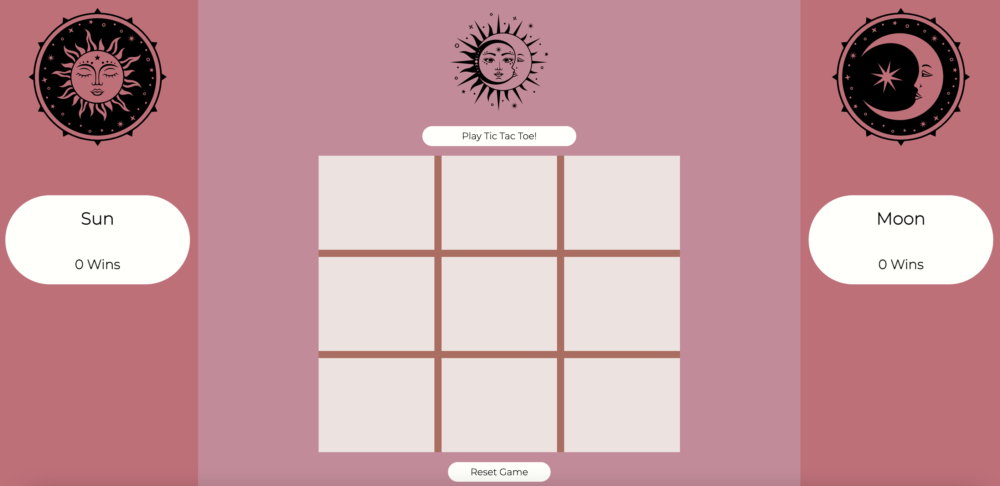

**Abstract:**
Is it dawn or is it dusk? In this game, two users can compete to sieze the day or take back the night with a brutal battle of tic tac toe. This game will tally the wins of each user and that data will be transferred to local storage, so it persists between reloads of the website. Ready to challenge another opponent? Hit the reset button to clear local storage and start a new game.

**Installation Instructions:**
Clone this repository to a local machine and open in a code editor. User terminal or other method of opening index.html in a live browser and let the fight between day and night commence!

**Preview of App:**

**Context:**
This is the final project of Module 1 for Turing School of Software Design. We were given one week to complete this solo challenge. I completed the MVP in 4 days and then spent some additional time adding extra elements and features to the game.

**Contributors:**
Kirsten Smith:
[GitHub](https://github.com/smithkirsten) 
[LinkedIn](https://www.linkedin.com/in/kirsten-stamm-smith/)

**Learning Goals:**
* Design a concept and wireframe for a website without a comp
* Use semantic HTML and CSS to create the application based on our own design
* Write dry JavaScript
* Use event delegation to handle similar event listeners
* Understand the difference between the data model and how the data is displayed on the DOM and create code that separates these processes
* Iterate through/filter DOM elements using for loops
* Use your problem solving process to break down large problems, solve things step by step, and trust yourself to not rely on an outside “answer” to a logical challenge
* Error handling
-Extras:-
* Use local storage to allow winner tally to persist when the page is reloaded

**Wins & Challenges:**

This project largely felt like a win! While I had moments of struggle with logic and bugs, I was able to work through these issues largely on my own with the problem-solving skills I have learned in the last 5 weeks. CSS still feels like my weakest point, but I noticed a huge improvement in how I was able to approach it between my last solo project and this one.
